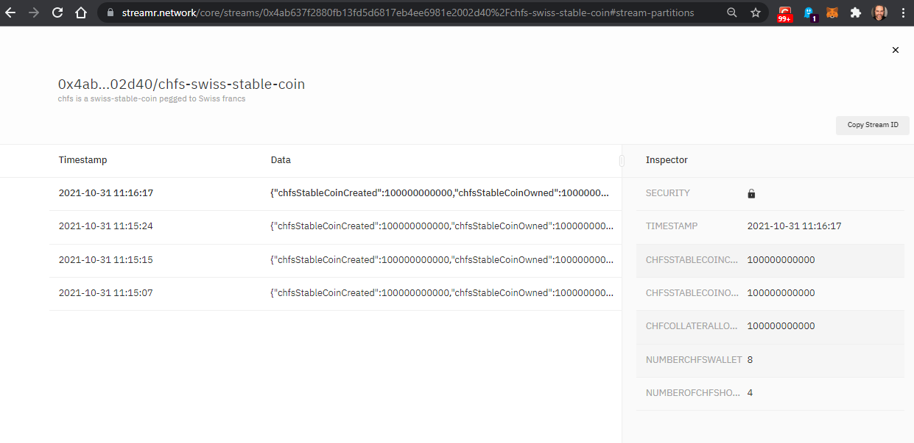
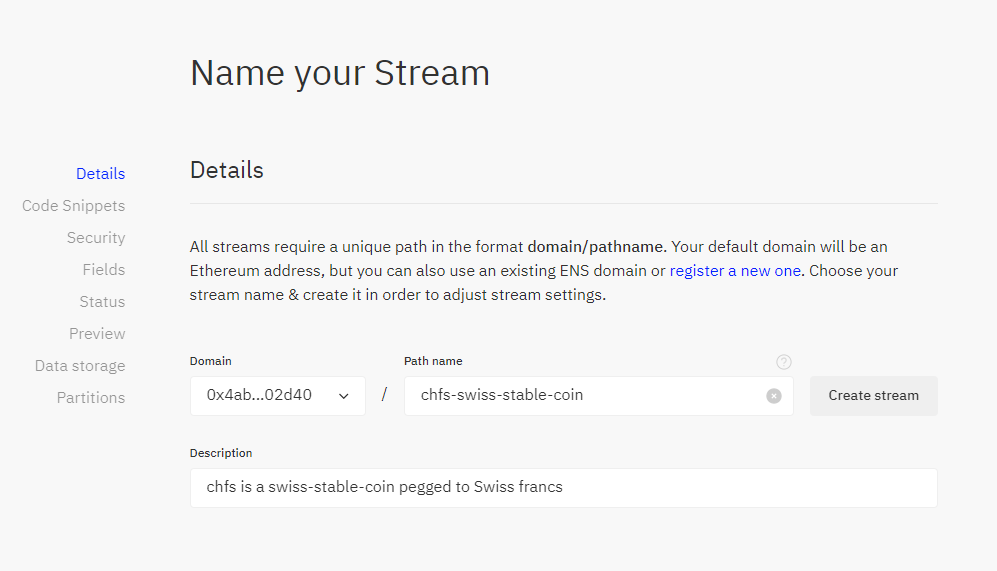

# Algorand Standard Assets (ASAs) meet Streamr CHF-S real time data stream

CHF-S was created using Algorand Standard Assets (ASAs).
Streamr https://streamr.network/ is the platform for real-time data on the decentralized web!

We publish real time data concerning CHF-S using Streamr
* Number of CHF-S owner: get from Algorand the number of owner having CHF-S in their wallet
* Amount of CHF collateralized by Julius Bär: we would get this value from Julius Bär back office system using API
* Amount of CHF-S minted: we get this value from Algorand using assetID
* Amount of CHF-S stable coins woned by individuals (= sum of all CHF-S balance of all account owner)

our Streamr is public at https://streamr.network/streams/0x4ab637f2880fb13fd5d6817eb4ee6981e2002d40%2Fchfs-swiss-stable-coin



# Subscribe to Streamr

```
yarn install
node subscribe-chfs-stream.js
```

# Publish to Streamr
Meant to be run in a cronjob at regular interval!
```
node publish-chfs-stream.js
```

# Connect metamask
Head to https://streamr.network and log in using metamask

# create a stream
Head to https://streamr.network/core/streams/new while being logged in metamask



# Setup
on windows you need to install "Visual Studio Build Tools"
```
choco install microsoft-build-tools -y
```


